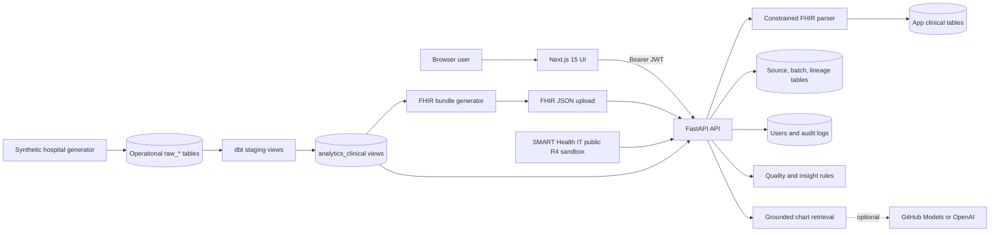

# ClinSight AI: Current Implementation

> Status snapshot: 2026-08-25, after incremental-plan Change 1 (source-aware FHIR resource upserts).
>
> This document describes what the repository implements today. It is based on the application source, Alembic migrations, dbt models, scripts, frontend, and tests. It intentionally distinguishes implemented behavior from product intent and production-ready behavior.

## Executive summary

ClinSight AI is a working full-stack clinical chart-review demo with three connected concerns:

1. A FastAPI application accepts a constrained subset of FHIR R4 Bundles, normalizes six resource types, persists patient-centric records, records source lineage, and exposes protected clinical APIs.
2. A separate synthetic hospital pipeline generates operational `raw_*` data, transforms it with dbt into app-shaped clinical views, and can export those views back into uploadable FHIR Bundles.
3. A Next.js application provides role-aware workflows for FHIR ingestion, patient search, longitudinal review, quality checks, rule-grounded insights, chart Q&A, source provenance, and audit review.

The repository is beyond a simple upload demo: it has migrations, two clinical read paths, four demo RBAC roles, provenance tables, audit events, external SMART Health IT sandbox import, deterministic clinical rules, optional LLM-assisted chart Q&A, Docker orchestration, repeatable synthetic data, and 30 passing backend tests.

It is still a demo/reference implementation rather than a production clinical system. Authentication uses locally created demo accounts and a shared password; FHIR support is intentionally narrow; patient identity reconciliation remains source-agnostic even though child-resource upserts are now source-safe; the AI safety checks are lightweight; and there is no production security, observability, deployment, or compliance layer.

## Incremental change-plan status

| Change | Status | Current result |
| --- | --- | --- |
| 1. Source-aware FHIR resource upserts | Complete and verified | Child records are inserted or updated by patient, source system, and FHIR resource ID. Omitted records are retained and records from different sources coexist. |
| 2–8 | Not implemented | Canonical identity, typed clinical dates, Airflow, durable failures, quarantine, SQL pagination, and pipeline observability remain future work. |

## System shape



There are two live record families:

- **Application-curated records** are SQLAlchemy rows in `patients`, `conditions`, `observations`, `encounters`, `medication_requests`, and `allergy_intolerances`. FHIR upload, generated-FHIR upload, sample seeding, and SMART sandbox import write here.
- **dbt-curated records** are read-only views in PostgreSQL under the configured clinical schema, normally `analytics_clinical`. They are derived from operational `raw_*` tables and shaped to resemble the application models.

The API deliberately hides this distinction from most callers through [`clinical_records.py`](../backend/app/services/clinical_records.py).

## Repository map

| Path | Current responsibility |
| --- | --- |
| [`backend/app/main.py`](../backend/app/main.py) | Creates FastAPI, configures CORS, and registers all route groups. |
| [`backend/app/api`](../backend/app/api) | HTTP endpoints and role dependencies. |
| [`backend/app/services`](../backend/app/services) | FHIR parsing/ingestion, unified clinical reads, quality rules, insights, chat, authentication, audit, and SMART client. |
| [`backend/app/models`](../backend/app/models) | SQLAlchemy mappings for clinical, provenance, raw, staging, user, and audit tables. |
| [`backend/alembic/versions`](../backend/alembic/versions) | Eight migrations representing the complete database evolution. |
| [`backend/scripts`](../backend/scripts) | Demo seeding, metrics, synthetic hospital generation, and FHIR export. |
| [`backend/tests`](../backend/tests) | 30 backend unit/API tests, using SQLite and mocked external services. |
| [`dbt/models/staging`](../dbt/models/staging) | Eight cleaning/normalization views over operational raw tables. |
| [`dbt/models/marts/clinical`](../dbt/models/marts/clinical) | Six clinical views matching the API's patient record concepts. |
| [`frontend/app`](../frontend/app) | Next.js App Router pages for workspace, login, patient detail, and audit logs. |
| [`frontend/components`](../frontend/components) | Client-side upload, search, external import, demo-role, and chart-chat panels. |
| [`docker-compose.yml`](../docker-compose.yml) | PostgreSQL, backend, frontend, and opt-in pipeline/test/seed/metrics services. |

Approximate source size at this snapshot is 4,457 backend application lines, 1,110 backend script lines, 1,405 backend test lines, 2,442 frontend TypeScript/TSX/CSS lines, and 952 dbt model/macro/documentation lines. Generated build and dbt artifacts are excluded.

## Runtime and configuration

### Backend

The backend is FastAPI with synchronous SQLAlchemy sessions. [`config.py`](../backend/app/core/config.py) loads `.env` and requires `DATABASE_URL`. Important settings are:

| Setting | Default/behavior |
| --- | --- |
| `DATABASE_URL` | Required. SQLite is supported locally/tests; Docker uses PostgreSQL 16. |
| `CLINICAL_SCHEMA` | `analytics_clinical`; used for dbt clinical views in PostgreSQL. |
| `CORS_ORIGINS` | Local Next.js origins; comma-separated values are normalized to a list. |
| `AUTH_SECRET_KEY` | Demo default `clinsight-demo-secret-change-me`. |
| `AUTH_TOKEN_EXPIRE_MINUTES` | 480 minutes. |
| `LLM_PROVIDER` | `none`; supported values in code are `github` and `openai`. |
| GitHub/OpenAI model settings | Optional tokens and model names for chart Q&A only. |

SQLite connections enable WAL and a 30-second busy timeout. PostgreSQL uses the normal SQLAlchemy pool with `pool_pre_ping`.

Alembic migrations are run automatically by the Docker backend command. The application itself does not create tables at startup.

### Frontend

The frontend uses Next.js 15.1.6, React 19, and TypeScript 5.7. Server-side API calls use `INTERNAL_API_BASE_URL`, while browser calls use `NEXT_PUBLIC_API_BASE_URL`. Requests disable caching and automatically attach the token from browser storage unless an explicit token is supplied.

### Docker Compose

The always-on services are:

- `db`: PostgreSQL 16 Alpine with a persistent named volume and health check.
- `backend`: migrates then runs Uvicorn on port 8000.
- `frontend`: builds and serves Next.js on port 3000.

The `tools` profile adds `generate-hospital-data`, `dbt-run`, `generate-fhir`, `backend-tests`, `seed`, and `metrics`. These are separate jobs, not a scheduled or automatically chained workflow.

## Database implementation

### Application clinical tables

The primary patient record is a one-to-many graph:

```text
patients
  ├── conditions
  ├── observations
  ├── encounters
  ├── medication_requests
  └── allergy_intolerances
```

Every child has an integer database ID, a `patient_id` foreign key with cascade deletion, an optional FHIR resource ID, normalized clinical fields, source metadata, and created/updated timestamps. Each child table has a source-aware uniqueness constraint on `(patient_id, source_system, fhir_resource_id)`. `patients.fhir_patient_id` remains globally unique pending the canonical identity change.

The six concepts retain only the fields used by this product:

| Concept | Persisted clinical fields |
| --- | --- |
| Patient | FHIR patient ID, full name, gender, birth date |
| Condition | code, name, clinical status, onset date |
| Observation | code, name, string value, unit, effective date |
| Encounter | status, class, type, start, end |
| MedicationRequest | status, intent, code, name, authored date |
| AllergyIntolerance | clinical/verification status, code, name, criticality, recorded date |

Dates in the ORM clinical tables are stored mostly as strings, not typed date/time columns. `transformed_at` and infrastructure timestamps use database date/time types.

### Source and lineage tables

The active FHIR ingestion path uses:

- `source_systems`: a reusable source definition.
- `ingestion_batches`: one row per accepted bundle, including filename, hash, status, record count, and timestamps.
- `patient_source_identifiers`: maps a source-specific FHIR patient ID to the application patient.
- `curated_record_sources`: maps each application clinical row to its source system, latest ingestion batch for that source/record pair, raw/FHIR record ID, and transform version.

Source metadata is also denormalized directly onto every clinical record as `source_type`, `source_system`, `source_record_id`, `ingestion_batch_id`, and `transformed_at`, which lets API responses and citations expose provenance without joining lineage tables.

Three FHIR sources are recognized from bundle metadata:

| Source | `source_type` | Recognition |
| --- | --- | --- |
| ClinSight FHIR Upload | `fhir_upload` | Default for unmarked Bundles |
| ClinSight Generated FHIR Bundle | `generated_fhir_bundle` | `meta.source` or generated-bundle tag |
| SMART Health IT R4 Sandbox | `external_fhir_api` | `meta.source` or SMART sandbox tag |

The content hash is recorded for traceability but is not used to reject or deduplicate uploads.

### Raw and staging layers

There are two generations of multi-source tables in the schema:

1. `raw_hospital_*` plus `staging_patient_identities` and `staging_clinical_resources` were introduced in migration `0003`. Their ORM mappings exist and reset/test setup knows about them, but the current synthetic generator and dbt project do not populate or read them.
2. The active operational pipeline uses eight simpler tables introduced in migration `0004`: `raw_patients`, `raw_encounters`, `raw_diagnoses`, `raw_labs`, `raw_medications`, `raw_allergies`, `raw_providers`, and `raw_departments`.

This means the earlier `raw_hospital_*`/ORM staging design is currently dormant schema, not part of the working data path.

## FHIR ingestion

### Accepted input

`POST /api/upload` accepts one UTF-8 `.json` file whose top-level `resourceType` is `Bundle`. The parser assumes one primary patient per bundle and supports:

- Patient
- Condition
- Observation
- Encounter
- MedicationRequest
- AllergyIntolerance

Unsupported resource types are counted in `resource_counts` but otherwise ignored. The first Patient becomes the bundle patient; later Patient resources are counted but ignored as patient entities.

The parser implements a deliberately small FHIR subset:

- First `name` block and first coding are used.
- Conditions use `onsetDateTime`.
- Observations support only `valueQuantity` and `valueString`, plus `effectiveDateTime`.
- Medication requests require `medicationCodeableConcept`; referenced Medication resources are not resolved.
- Encounter and allergy fields are reduced to those stored by the application.
- Parsed subject/patient references are retained in temporary dictionaries but are not validated against the selected Patient before persistence.

This is structural extraction, not full FHIR profile validation, terminology validation, or referential integrity checking.

### Persistence behavior

[`ingest_fhir_bundle`](../backend/app/services/ingestion.py) performs the following transaction:

1. Parse the Bundle and require a Patient.
2. Resolve/create the source system.
3. create a processed ingestion-batch row with content hash and total resource count.
4. Find the application patient by globally unique `fhir_patient_id`.
5. Create the patient or update its demographics; patient lookup is still by global `fhir_patient_id`.
6. For every supported child with a FHIR ID, find a row by `(patient_id, source_system, fhir_resource_id)` and update it, or insert it when absent. Resources without a FHIR ID are inserted because no stable source key is available.
7. Upsert per-source lineage to the latest ingestion batch and upsert the source-specific patient identifier.
8. Commit once and return patient ID, `created`/`updated`, and resource counts.

Repeated delivery of the same source Bundle is idempotent at the identified child-record level. Changed incoming fields update the existing record and lineage batch, while a child omitted from a later Bundle is retained. No deletion or tombstone semantics are implemented yet.

Identical child FHIR IDs from two recognized source systems can coexist under the currently resolved patient, and an update from one source no longer overwrites the other source's child record. Patient resolution itself is not source-aware yet: two systems presenting the same patient FHIR ID still resolve to the same global `patients` row, whose demographics and denormalized patient-level source metadata reflect the latest import. Canonical/source-specific patient identity is Change 2.

If parsing or persistence fails, the transaction rolls back. Because the batch row is part of the same transaction, failed attempts are not retained as failed `ingestion_batches` records.

### External SMART Health IT import

The external client targets the fixed public endpoint `https://r4.smarthealthit.org`:

- Search calls `Patient?name=...&_count=...`.
- Import fetches the Patient and the first page (up to 100) of Condition, Observation, Encounter, MedicationRequest, and AllergyIntolerance resources.
- The client wraps the results in a marked collection Bundle and passes it through the same ingestion function as file upload.

This is a public sandbox integration, not a SMART App Launch implementation. There is no OAuth launch context, patient-scoped authorization, configurable FHIR server, pagination beyond the requested page, retry policy, or capability/profile negotiation.

## Synthetic hospital and dbt pipeline

### Raw generation

[`generate_hospital_data.py`](../backend/scripts/generate_hospital_data.py) deterministically generates linked operational data from a seed. Defaults are 1,000 patients, seed 42, source `internal_hospital_ods`, and batch `synthetic-42-1000`.

It creates patients, encounters, diagnoses, labs, medications, allergies, providers, and departments. Controlled scenarios include diabetes without A1c, hypertension without blood pressure data, conflicting values, and active diagnoses without active medications. A rerun of the same source and batch first deletes only that batch's raw rows, then inserts the regenerated set. It also writes a `hospital_data_batch_generated` system audit event.

### dbt transformation

The dbt profile is PostgreSQL-only. Its eight staging views normalize whitespace, casing, identifiers, booleans, dates, and statuses from `public.raw_*`. Schema tests cover important uniqueness, non-null, accepted-value, and relationship constraints.

Six clinical marts map operational rows into app-compatible concepts. IDs are deterministic positive-ish 60-bit integers derived from MD5 input. The default dbt naming configuration produces `analytics_staging` and `analytics_clinical` schemas.

Key mapping behavior:

- Patient ID is derived from MRN. The patient mart keeps one latest row per MRN across available raw batches.
- Diagnosis types are mapped to `active` or `resolved` conditions.
- Encounter status is derived from admission/discharge timestamps.
- Labs become Observations.
- Medication order statuses are normalized and intent is always `order`.
- Allergy severity is mapped to FHIR-like criticality.
- All marts retain operational source, record, batch, ingestion, and transformation fields.

The child marts do not select only the latest batch. If multiple different batches contain the same MRN, the latest patient demographic row is selected while child records from all available batches can appear under the same stable patient ID. This can be useful as history, but it can also produce duplicates unless upstream batch semantics are controlled.

### FHIR export

[`generate_fhir_bundles.py`](../backend/scripts/generate_fhir_bundles.py) reads the unified clinical service, constructs one collection Bundle per selected patient, and writes JSON files. It creates stable-looking resource IDs from the database/view IDs and tags each Bundle as generated.

Export and import are separate steps. Generating a Bundle does not insert it into the application clinical tables; a generated file must still be uploaded or seeded if that copy is desired in the ORM tables.

## Unified clinical read behavior

The patient API can surface both application rows and dbt views:

- PostgreSQL dbt tables are resolved as `<CLINICAL_SCHEMA>.<table>`.
- SQLite tests use optional `clinical_<table>` tables to emulate the view shape.
- Patient listing loads application patients and, when present, dbt patients; it merges them by numeric ID, sorts descending, and applies offset/limit in Python.
- Application rows overwrite dbt rows on numeric ID collision.
- Patient detail first looks in the application `patients` table, then falls back to the dbt patient view.
- dbt detail children are fetched from each clinical view by the stable patient ID and adapted to in-memory namespaces so downstream quality, insights, schemas, and frontend code see the same interface.

Consequences of the current design:

- Pagination happens after both complete result sets are loaded; it is suitable for a demo, not a large directory.
- Search semantics differ slightly by source and database dialect.
- There is no enterprise identity resolution between an uploaded patient and a dbt patient. They coexist unless their numeric IDs happen to collide.
- Integer namespaces differ: ORM IDs are database sequences; dbt IDs are hashes. A collision is unlikely but is handled by silently preferring ORM data.
- Every dbt read checks table existence through SQLAlchemy inspection; there is no cached catalog or materialized repository abstraction.

## API and RBAC

There are 13 routed API operations plus the public root health/message route.

| Method and path | Roles | Behavior |
| --- | --- | --- |
| `POST /api/auth/login` | Public | Validate/create demo account and issue token. |
| `GET /api/auth/me` | Any authenticated | Return current user and UI permission labels. |
| `GET /api/patients` | All four roles | Search/list unified patient records with limit/offset. |
| `GET /api/patients/{id}` | All four roles | Return full chart and audit patient access. |
| `GET /api/patients/{id}/quality-alerts` | Admin, data reviewer | Run structured quality checks. |
| `GET /api/patients/{id}/ai-insights` | Admin, clinician, care coordinator | Build insights and audit report access. |
| `POST /api/patients/{id}/chat` | All four roles | Answer a grounded chart question and audit it. |
| `POST /api/upload` | Admin, data reviewer | Ingest uploaded Bundle and audit it. |
| `GET /api/external-fhir/smart/patients` | Admin, data reviewer | Search public sandbox and audit search. |
| `POST /api/external-fhir/smart/import/{id}` | Admin, data reviewer | Fetch/import sandbox chart and audit import. |
| `GET /api/demo-users` | All four roles | Return three product walkthrough personas. |
| `GET /api/audit-logs` | Admin, data reviewer | Filter/paginate audit events. |
| `POST /api/audit-logs/dbt-transformation` | Admin, data reviewer | Manually record triggered/completed dbt event. |

The four security roles are `admin`, `clinician`, `care_coordinator`, and `data_reviewer`. Route dependencies are the authoritative enforcement. The permission strings returned by `/auth/me` are descriptive; route checks do not dynamically evaluate those strings.

The dbt transformation audit endpoint is not called by the Compose `dbt-run` job. A caller must invoke it separately, so dbt run auditing is currently an available API convention rather than an end-to-end automatic integration.

## Authentication and audit

On login, the backend lazily ensures four demo users exist:

| Username | Display name | Role |
| --- | --- | --- |
| `admin` | Admin Reviewer | admin |
| `clinician` | Dr. Maya Chen | clinician |
| `care` | Alex Rivera | care coordinator |
| `reviewer` | Sam Patel | data reviewer |

All use the shared demo password `clinsight-demo`. Passwords are PBKDF2-HMAC-SHA256 hashes with random salts and 120,000 iterations. Access tokens are compact HMAC-SHA256 JWT-shaped values implemented directly in the service; only subject, username, role, and expiration are encoded.

The browser stores the token and user in `localStorage` and duplicates the token in a JavaScript-readable cookie so server-rendered patient/audit pages can authenticate. There is no refresh token, revocation list, session table, CSRF token, `HttpOnly` cookie, secure-cookie enforcement, user-management API, password-change flow, or external identity provider.

Audit records include user/role, action, resource type/ID, derived patient ID, timestamp, and JSON metadata. Implemented events cover login, patient detail access, insight access, chart questions, uploads, external searches/imports, synthetic batch generation, and manually reported dbt transformations. Directory listing, quality-alert viewing, demo-persona viewing, audit-log viewing, and `/auth/me` are not audited.

Audit rows are normal mutable database records. The repository does not implement append-only database permissions, cryptographic chaining, retention policy, PHI redaction, request correlation IDs, IP/user-agent capture, or export to a compliance/SIEM platform.

## Quality engine

[`quality_checker.py`](../backend/app/services/quality_checker.py) is a deterministic rule registry. It reports structured code, severity, category, field, and message values, sorted warning before info.

Implemented checks are:

- missing patient name, gender, or birth date;
- missing conditions, observations, encounters, medications, or allergies;
- condition missing a name;
- observation missing a value or, in most cases, a unit;
- encounter missing status or start;
- medication missing name or status;
- allergy missing name or verification status.

There are no critical rules in the current registry. The engine does not validate coding systems, plausible values/ranges, units, duplicates, temporal freshness, reference integrity, or cross-source reconciliation.

## Grounded insight engine

The patient insight report is deterministic, despite the “AI insights” API name. [`ai_insights.py`](../backend/app/services/ai_insights.py) does not call an LLM.

It builds:

- summary sections for demographics/chart density, up to five active conditions, up to five recent observations, up to five active medications, and up to five allergies;
- inconsistency findings for encounter end-before-start, conflicting values for the same observation code/date, active-vs-resolved condition conflicts, and active-vs-stopped medication conflicts;
- care-gap suggestions for diabetes without any A1c observation, hypertension without any blood-pressure observation, active conditions without encounters, active conditions without active medication requests, missing allergies, and warning-level quality issues.

Every generated claim/finding receives citation IDs such as `Condition:42`. Citations include a compact excerpt and source metadata.

The evaluation layer counts cited and uncited summary claims, detects citation IDs that do not resolve, calculates cited-record coverage, and labels hallucination risk:

- `high` if a summary claim is uncited or a claim/finding has an unresolved citation;
- `medium` if coverage is below 25%;
- otherwise `low`.

This evaluation confirms internal linkage, not clinical truth. In particular:

- Negative claims such as “no active medications” cite only the patient row, not a query snapshot.
- A1c and blood-pressure care gaps check whether any matching observation exists; they do not enforce a recency window.
- “Active” status is a small hard-coded set.
- Source coverage can be low because the summary intentionally limits records to the latest five.
- The rules are not versioned in a registry beyond the returned label `ClinSight grounded insight rules v1`.

## Grounded patient chart assistant

Chart Q&A is a separate service from the insight report. It always starts with deterministic, patient-specific retrieval:

- A1c/diabetes, blood pressure/hypertension, medications, allergies, encounters, recent observations, and active conditions have keyword-specific retrieval paths.
- Unrecognized questions fall back to a limited general chart selection.
- Retrieval is capped at 24 evidence items.
- A hard-coded phrase list refuses obvious diagnosis, prescribing, dose-change, discharge, and treatment-plan requests.

With `LLM_PROVIDER=none` or on any provider/configuration/error failure, the response is assembled deterministically from retrieved record descriptions. With a configured GitHub Models or OpenAI token, the service sends only the retrieved evidence and asks for strict JSON. GitHub uses Chat Completions; OpenAI uses the Responses API.

Returned LLM JSON is accepted only if it has a non-empty answer, all returned citation IDs exist in retrieved evidence, and the answer does not match the same treatment-advice phrase detector. Otherwise the service silently falls back to deterministic wording.

Current safety limitations include:

- Keyword retrieval rather than semantic/vector retrieval.
- No conversation history; every question is independent and the browser retains only five local responses.
- No model output moderation or medical-entity validation.
- Citation validation checks identifiers, but does not verify that every factual sentence is entailed by the cited record.
- The response returns all retrieved citations rather than only the LLM's selected citation IDs.
- The phrase-based refusal filter can miss unsafe wording or create false positives.

## Frontend implementation

### Routes

| Route | Rendering and behavior |
| --- | --- |
| `/` | Client-rendered workspace. Reads stored user after hydration, shows role-aware ingestion tools, patient directory, and walkthrough personas. |
| `/login` | Client form with the four demo accounts and shared password prefilled. |
| `/patients/[id]` | Server-rendered protected chart. Reads token cookie, fetches user/patient and role-allowed data, then renders client chart chat inside it. |
| `/audit` | Server-rendered protected audit list for admin/data reviewer. |

The root page itself does not redirect unauthenticated users; it shows sign-in guidance and hides protected controls. API RBAC remains authoritative.

### Role-specific chart presentation

- **Admin:** summary, inconsistencies, care gaps, quality, provenance, ingestion, external import, audit, and chat.
- **Clinician:** summary, inconsistencies, chart/timeline, and chat; no care gaps, quality panel, provenance detail, ingestion, or audit.
- **Care coordinator:** care gaps, chart/timeline, and chat; no summary/inconsistency panel, quality, provenance detail, ingestion, or audit.
- **Data reviewer:** quality, provenance, ingestion, external import, audit, chart/timeline, and chat; no summary/inconsistency or care-gap presentation.

The backend allows care coordinators to call the insight-report endpoint because their care gaps come from that combined response. The frontend then suppresses summary and inconsistency presentation for that role.

### Patient chart

The chart includes demographics and source header, allergy chips with overflow popover, grounded summary with citations, chart Q&A, a reverse-date timeline, care gaps, inconsistencies, grounding metrics, quality alerts, and resource counts. Source-system/record/batch text is shown only to admin and data reviewer roles.

The timeline merges all five child resource types and sorts lexically by their source date strings. Invalid or differently formatted dates can therefore sort imperfectly even though display formatting attempts to parse them.

## Tests and verification status

At this snapshot:

- `backend/.venv/bin/python -m pytest -q`: **30 passed**.
- Alembic `upgrade -> downgrade 0007 -> upgrade` on SQLite: **successful**, ending at `0008_source_aware_fhir_keys`.
- `npm run build`: **successful**, including TypeScript validation and production compilation.

Backend coverage includes:

- FHIR parsing and upload;
- exact Bundle re-upload without duplicate child records;
- same-source field updates while omitted child records remain;
- coexistence and lineage for identical resource IDs from different sources;
- source systems, ingestion batches, patient identifiers, and curated lineage;
- quality rules and grounded insight evaluation;
- deterministic chat, treatment refusal, mocked GitHub Models use, and chat audit;
- manually created dbt-shaped SQLite clinical tables flowing through patient, quality, and insight APIs;
- authentication, RBAC, patient access audit, audit filtering/reporting;
- mocked SMART search/import;
- raw operational models and deterministic generator scenarios;
- generated FHIR validity and re-upload.

Important test boundaries:

- There are no frontend component/browser tests.
- There is no automated full PostgreSQL + dbt + FastAPI end-to-end test in the test suite.
- External FHIR and LLM HTTP calls are mocked.
- The dbt-shaped API test creates compatible SQLite tables; it does not run dbt SQL.
- No visible CI workflow runs these checks on commit.

## Current implementation gaps and risks

The most important engineering gaps, in priority order, are:

1. **Production security is not implemented.** Demo users, shared credentials, a default signing secret, readable browser token storage, and no token revocation are intentionally non-production.
2. **Patient identity is still globally keyed.** Child upserts are source-aware, but a globally matched FHIR patient ID still maps different sources to one patient and lets the latest import replace patient demographics/source metadata; uploaded and dbt patients otherwise remain separate identities.
3. **FHIR conformance is narrow.** There is no schema/profile validation, reference enforcement, terminology service, paging loop, or broad datatype support.
4. **The dormant and active raw/staging designs overlap.** `raw_hospital_*`/ORM staging tables remain in migrations while the live pipeline uses `raw_*` and dbt views.
5. **dbt batch semantics can mix child history.** Latest patient demographics and all-batch child marts use different selection rules.
6. **Grounding checks are structural, not entailment checks.** They prove citations resolve, but not that conclusions are clinically correct or fully supported.
7. **Audit is useful but not compliance-grade.** It is neither immutable nor comprehensive, and dbt audit reporting is manual.
8. **Scale behavior is demo-oriented.** Unified listing loads entire sources before pagination, SMART retrieval is synchronous, and insight/chat rules run in the request process.
9. **Operational readiness is limited.** Compose contains demo database credentials; there is no production secrets flow, TLS/reverse-proxy config, worker strategy, monitoring, tracing, backup policy, rate limiting, or CI/CD.
10. **Clinical governance is absent.** There is no ruleset approval/version lifecycle, clinician feedback workflow, model governance, prompt/version logging, or validation against clinical standards.

## What the repository can credibly demonstrate today

ClinSight AI currently demonstrates an end-to-end, source-aware clinical data product:

```text
FHIR or synthetic operational input
  → parsing/normalization or dbt transformation
  → unified patient record access
  → role-aware longitudinal chart
  → data quality and deterministic clinical rules
  → cited insight/chat output
  → audit events and provenance display
```

That flow is implemented and tested. The right positioning is a technically substantive clinical-data and grounded-AI prototype with explicit safety and traceability concepts—not a production EHR integration, diagnostic system, or compliance-certified clinical application.
