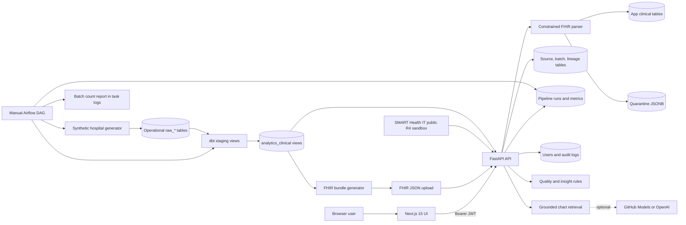

# ClinSight AI: Current Implementation

> Status snapshot: 2026-08-26, after incremental-plan Change 8, the read-only ingestion/quarantine investigation UI, and topic-specific chart-Q&A retrieval correction.
>
> This document describes what the repository implements today. It is based on the application source, Alembic migrations, dbt models, scripts, frontend, and tests. It intentionally distinguishes implemented behavior from product intent and production-ready behavior.

## Executive summary

ClinSight AI is a working full-stack clinical chart-review demo with three connected concerns:

1. A FastAPI application accepts a constrained subset of FHIR R4 Bundles, normalizes six resource types, persists patient-centric records, records source lineage, and exposes protected clinical APIs.
2. A synthetic hospital pipeline generates operational `raw_*` data, transforms it with dbt into app-shaped clinical views, and can export those views back into uploadable FHIR Bundles. Its generation, dbt build, dbt test, and metrics steps can also run as one manually triggered Airflow DAG.
3. A Next.js application provides role-aware workflows for FHIR ingestion, ingestion-batch/quarantine investigation, patient search, longitudinal review, quality checks, rule-grounded insights, chart Q&A, source provenance, and audit review.

The repository is beyond a simple upload demo: it has migrations, two clinical read paths, four demo RBAC roles, provenance tables, durable ingestion and pipeline-run states, record-level quarantine with a protected investigation screen, SQL-backed unified patient-directory pagination, operational metrics APIs/scripts, audit events, external SMART Health IT sandbox import, deterministic clinical rules, optional LLM-assisted chart Q&A, Docker orchestration, repeatable synthetic data, an opt-in Airflow orchestrator, and 79 passing backend tests.

It is still a demo/reference implementation rather than a production clinical system. Authentication uses locally created demo accounts and a shared password; FHIR support is intentionally narrow; patient identity is source-aware but only explicitly mapped rather than probabilistically reconciled; the AI safety checks are lightweight; and there is no production security, monitoring/alerting, deployment, or compliance layer.

## Incremental change-plan status

| Change | Status | Current result |
| --- | --- | --- |
| 1. Source-aware FHIR resource upserts | Complete and verified | Child records are inserted or updated by patient, source system, and FHIR resource ID. Omitted records are retained and records from different sources coexist. |
| 2. Canonical/source-aware patient identity | Complete and verified | `patient_source_identifiers` is authoritative for ingestion lookup. Identical patient IDs from different sources remain separate unless explicitly mapped to one canonical patient. |
| 3. Typed clinical timestamps | Complete and verified | Six clinical timeline fields use timezone-aware ORM/database types, valid FHIR inputs normalize to UTC, and timeline/latest-record sorting compares actual instants. Change 6 now quarantines children with explicitly invalid date values. |
| 4. Airflow orchestration for the synthetic hospital pipeline | Complete and verified within the local test boundary | One manual DAG chains raw generation, dbt run, dbt test, and a batch-scoped count report, with two retries and a shared batch ID. The optional Compose profile leaves normal startup unchanged. |
| 5. Persist failed ingestion batch states | Complete and verified | Each accepted Bundle attempt first commits a `processing` batch. Clinical work then commits with `success`, or rolls back independently before the batch is finalized as `failed` with counts, completion time, and a sanitized error. |
| 6. Quarantine record-level validation failures | Complete and verified | Invalid supported child resources are stored with source/batch linkage and raw JSON while valid siblings continue. Accepted, rejected, and unsupported counts are returned without exposing quarantined payloads. |
| 7. Move patient pagination/search into SQL | Complete and verified | One repository query combines application and dbt patient summaries with `UNION ALL`, resolves numeric-ID overlaps in SQL, filters and sorts in SQL, and retrieves only the requested offset/limit page. |
| 8. Minimal pipeline observability | Complete and verified within the local test boundary | FHIR and Airflow runs persist independent operational lifecycle/count/duration records. Protected recent-run and aggregate-metrics APIs, a metrics CLI, structured FHIR/dbt logs, and Airflow terminal-failure recording expose pipeline health without using user audit events. |

After Change 8, a read-only operational investigation surface was added for admins and data reviewers. It exposes batch summaries and quarantine metadata, and requires a separate audited request before returning a raw quarantined payload. It does not change the numbered incremental plan or add remediation/replay behavior.

## System shape



There are two live record families:

- **Application-curated records** are SQLAlchemy rows in `patients`, `conditions`, `observations`, `encounters`, `medication_requests`, and `allergy_intolerances`. FHIR upload, generated-FHIR upload, sample seeding, and SMART sandbox import write here.
- **dbt-curated records** are read-only views in PostgreSQL under the configured clinical schema, normally `analytics_clinical`. They are derived from operational `raw_*` tables and shaped to resemble the application models.

The API deliberately hides this distinction from most callers through [`clinical_records.py`](../backend/app/services/clinical_records.py).

## Repository map

| Path | Current responsibility |
| --- | --- |
| [`backend/app/main.py`](../backend/app/main.py) | Creates FastAPI, configures CORS, and registers all route groups. |
| [`backend/app/api`](../backend/app/api) | HTTP endpoints and role dependencies. |
| [`backend/app/services`](../backend/app/services) | FHIR parsing/ingestion, ingestion investigation queries, unified clinical reads, quality rules, insights, chat, authentication, audit, and SMART client. |
| [`backend/app/repositories`](../backend/app/repositories) | Bounded database queries; currently the SQL-backed unified patient directory. |
| [`backend/app/models`](../backend/app/models) | SQLAlchemy mappings for clinical, provenance, raw, staging, user, and audit tables. |
| [`backend/alembic/versions`](../backend/alembic/versions) | Fourteen migrations representing the complete database evolution. |
| [`backend/scripts`](../backend/scripts) | Demo seeding, interview metrics, synthetic hospital generation, batch count reporting, and FHIR export. |
| [`backend/tests`](../backend/tests) | 79 backend unit/API/configuration tests, using SQLite and mocked external services. |
| [`dbt/models/staging`](../dbt/models/staging) | Eight cleaning/normalization views over operational raw tables. |
| [`dbt/models/marts/clinical`](../dbt/models/marts/clinical) | Six clinical views matching the API's patient record concepts. |
| [`airflow/dags`](../airflow/dags) | One manually triggered synthetic-to-dbt DAG plus a dependency-light task definition used by tests. |
| [`frontend/app`](../frontend/app) | Next.js App Router pages for workspace, login, patient detail, audit logs, and ingestion/quarantine investigation. |
| [`frontend/components`](../frontend/components) | Client-side upload, search, external import, ingestion investigation, demo-role, and chart-chat panels. |
| [`docker-compose.yml`](../docker-compose.yml) | PostgreSQL, backend, frontend, opt-in pipeline/test/seed/metrics jobs, and an isolated `airflow` profile. |

Approximate source size at this snapshot is 5,850 backend application lines, 1,455 backend script lines, 2,626 backend test lines, 4,141 frontend TypeScript/TSX/CSS lines, 934 dbt model/macro/documentation lines, and 192 Airflow image/DAG/requirement lines. Generated build, dependency, and dbt artifacts are excluded.

## Runtime and configuration

### Backend

The backend is FastAPI with synchronous SQLAlchemy sessions. [`config.py`](../backend/app/core/config.py) loads `.env` and requires `DATABASE_URL`. Important settings are:

| Setting | Default/behavior |
| --- | --- |
| `DATABASE_URL` | Required. SQLite is supported locally/tests; Docker uses PostgreSQL 16. |
| `CLINICAL_SCHEMA` | `analytics_clinical`; used for dbt clinical views in PostgreSQL. |
| `CORS_ORIGINS` | Local Next.js origins; comma-separated values are normalized to a list. |
| `AUTH_SECRET_KEY` | Demo default `clinsight-demo-secret-change-me`. |
| `AUTH_TOKEN_EXPIRE_MINUTES` | 480 minutes. |
| `LLM_PROVIDER` | `none`; supported values in code are `github` and `openai`. |
| GitHub/OpenAI model settings | Optional tokens and model names for chart Q&A only. |

SQLite connections enable WAL and a 30-second busy timeout. PostgreSQL uses the normal SQLAlchemy pool with `pool_pre_ping`.

Alembic migrations are run automatically by the Docker backend command. The application itself does not create tables at startup.

### Frontend

The frontend uses Next.js 15.1.6, React 19, and TypeScript 5.7. Server-side API calls use `INTERNAL_API_BASE_URL`, while browser calls use `NEXT_PUBLIC_API_BASE_URL`. Requests disable caching and automatically attach the token from browser storage unless an explicit token is supplied.

### Docker Compose

The always-on services are:

- `db`: PostgreSQL 16 Alpine with a persistent named volume and health check.
- `backend`: migrates then runs Uvicorn on port 8000.
- `frontend`: builds and serves Next.js on port 3000.

The `tools` profile adds `generate-hospital-data`, `dbt-run`, `generate-fhir`, `backend-tests`, `seed`, and `metrics` as independent jobs. The separate `airflow` profile adds a local Airflow 3.3.1 standalone service that automatically chains the synthetic generation and dbt validation steps only when its DAG is manually triggered. Neither profile starts during normal `docker compose up --build` startup.

## Database implementation

### Application clinical tables

The primary patient record is a one-to-many graph:

```text
patients
  ├── conditions
  ├── observations
  ├── encounters
  ├── medication_requests
  └── allergy_intolerances
```

Every child has an integer database ID, a `patient_id` foreign key with cascade deletion, an optional FHIR resource ID, normalized clinical fields, source metadata, and created/updated timestamps. Each child table has a source-aware uniqueness constraint on `(patient_id, source_system, fhir_resource_id)`. `patients.fhir_patient_id` remains as a legacy/display field but is no longer globally unique or used for ingestion resolution.

The six concepts retain only the fields used by this product:

| Concept | Persisted clinical fields |
| --- | --- |
| Patient | FHIR patient ID, full name, gender, birth date |
| Condition | code, name, clinical status, onset date |
| Observation | code, name, string value, unit, effective date |
| Encounter | status, class, type, start, end |
| MedicationRequest | status, intent, code, name, authored date |
| AllergyIntolerance | clinical/verification status, code, name, criticality, recorded date |

The six timeline fields—condition onset, observation effective time, encounter start/end, medication authored time, and allergy recorded time—use `DateTime(timezone=True)`. PostgreSQL therefore uses timezone-aware timestamps; SQLite uses its `DATETIME` representation and the API boundary treats SQLite's timezone-naive values as UTC. Patient birth date remains a date string because Change 3 only targets timeline/filtering fields.

FHIR date-only inputs are normalized to UTC midnight, timestamp offsets are converted to UTC, and timestamps without an offset are conservatively interpreted as UTC. Missing/null values remain null; explicit invalid values now quarantine the affected child resource during FHIR ingestion. Legacy migration conversion still maps unparseable stored strings to null. API and generated-FHIR output remain ISO 8601 strings with a `Z` suffix.

### Source and lineage tables

The active FHIR ingestion path uses:

- `source_systems`: a reusable source definition.
- `ingestion_batches`: one durable row per Bundle passed to the ingestion service, including filename, hash, lifecycle status, total/accepted/rejected counts, sanitized error, and start/completion timestamps.
- `quarantine_records`: rejected supported resources linked to their ingestion batch and source system, with resource identity, stable error code/message, raw payload, and creation time. PostgreSQL stores the payload as `JSONB`; SQLite uses `JSON` for local tests.
- `patient_source_identifiers`: authoritatively maps a source-specific patient identifier to the canonical application patient. `(source_system_id, identifier_value)` is unique; `identifier_type` remains descriptive.
- `curated_record_sources`: maps each application clinical row to its source system, latest ingestion batch for that source/record pair, raw/FHIR record ID, and transform version.

Source metadata is also denormalized directly onto every clinical record as `source_type`, `source_system`, `source_record_id`, `ingestion_batch_id`, and `transformed_at`, which lets API responses and citations expose provenance without joining lineage tables.

Migration `0009_canonical_patient_identity` removes the global uniqueness constraint from `patients.fhir_patient_id`, changes the source-identifier constraint to `(source_system_id, identifier_value)`, and backfills a source mapping for an existing patient when `patients.source_system` matches a `source_systems.name`. Existing rows without a matching source-system definition are left unchanged rather than guessed.

Migration `0010_typed_clinical_dates` adds typed temporary columns, parses and copies valid legacy values, leaves invalid/unparseable values null, then replaces the old string columns. Its downgrade serializes typed values back to UTC ISO text. This copy strategy avoids database casts that can abort on malformed PostgreSQL data or mis-convert SQLite strings.

Migration `0011_durable_batch_states` replaces the older `received_at`, `processed_at`, and `error_summary` columns with `started_at`, `completed_at`, and `error_message`, then adds accepted/rejected counts. Existing `processed` batches migrate to `success` with their original record counts and timestamps; downgrade restores the legacy names and status.

Migration `0012_quarantine_records` adds the batch/source-linked quarantine table and indexes its identifiers, resource type, and error code. Deleting an ingestion batch cascades to its quarantined resources.

Migration `0013_patient_directory_indexes` adds a standalone index on `patient_source_identifiers.identifier_value`. The canonical application patient ID is already indexed by its primary key, while patient name, FHIR patient ID, and source record ID already have model indexes. The new standalone index avoids relying on the existing composite uniqueness index, whose leading column is `source_system_id`, for source-identifier lookup. The current contains-search syntax (`%term%`) may still require scanning candidate rows; PostgreSQL trigram/full-text search is not enabled.

Migration `0014_pipeline_runs` adds the operational `pipeline_runs` table. `(pipeline_name, run_id)` is unique, while pipeline name, run ID, source system, batch ID, status, and start time are individually indexed for recent-run and filtered-metrics queries. Each row stores `processing`, `success`, or `failed` state; start/completion times and calculated duration; received, accepted, rejected, and duplicate/updated counts; and a sanitized terminal error. `batch_id` is intentionally a string rather than a foreign key because it links both integer-backed FHIR ingestion batches and Airflow's externally assigned synthetic batch identifiers.

Pipeline runs are operational records separate from `audit_logs`: they describe machine workflow health, not user access or actions. FHIR runs use `fhir_ingestion` and run IDs of the form `fhir-ingestion-{ingestion_batch_id}`. The synthetic DAG uses `clinsight_hospital_pipeline` and the Airflow run ID. Both retain their source and batch identifiers so operators can trace a run to ingestion and curated-record lineage.

Three FHIR sources are recognized from bundle metadata:

| Source | `source_type` | Recognition |
| --- | --- | --- |
| ClinSight FHIR Upload | `fhir_upload` | Default for unmarked Bundles |
| ClinSight Generated FHIR Bundle | `generated_fhir_bundle` | `meta.source` or generated-bundle tag |
| SMART Health IT R4 Sandbox | `external_fhir_api` | `meta.source` or SMART sandbox tag |

The content hash is recorded for traceability but is not used to reject or deduplicate uploads.

### Raw and staging layers

There are two generations of multi-source tables in the schema:

1. `raw_hospital_*` plus `staging_patient_identities` and `staging_clinical_resources` were introduced in migration `0003`. Their ORM mappings exist and reset/test setup knows about them, but the current synthetic generator and dbt project do not populate or read them.
2. The active operational pipeline uses eight simpler tables introduced in migration `0004`: `raw_patients`, `raw_encounters`, `raw_diagnoses`, `raw_labs`, `raw_medications`, `raw_allergies`, `raw_providers`, and `raw_departments`.

This means the earlier `raw_hospital_*`/ORM staging design is currently dormant schema, not part of the working data path.

## FHIR ingestion

### Accepted input

`POST /api/upload` accepts one UTF-8 `.json` file whose top-level `resourceType` is `Bundle`. The parser assumes one primary patient per bundle and supports:

- Patient
- Condition
- Observation
- Encounter
- MedicationRequest
- AllergyIntolerance

Unsupported resource types are counted but otherwise ignored. The first usable Patient becomes the bundle patient; malformed Patient candidates and additional Patient resources are rejected. A Bundle without any usable Patient is batch-fatal.

The parser implements a deliberately small FHIR subset:

- First `name` block and first coding are used.
- Conditions use `onsetDateTime`.
- Observations support only `valueQuantity` and `valueString`, plus `effectiveDateTime`.
- Medication requests require `medicationCodeableConcept`; referenced Medication resources are not resolved.
- Encounter and allergy fields are reduced to those stored by the application.
- The six supported clinical date/time fields pass through one parser and become UTC `datetime` values before ORM persistence. Explicit invalid values reject that child; absent/null optional values remain null.
- Every supported child must have a resource ID and a patient reference that resolves to the selected Patient. Absolute references containing `/Patient/{id}` are normalized before comparison.
- Conditions and allergies require a transformable code/display; Observations additionally require `valueQuantity.value` or a non-empty `valueString`; Encounters require status; MedicationRequests require status, intent, and a transformable medication code/display.

This is a narrow product validation boundary, not full FHIR profile/terminology validation. It checks only fields and representations required by the current transformation.

### Persistence behavior

[`ingest_fhir_bundle`](../backend/app/services/ingestion.py) uses two transaction phases:

1. Resolve/create the source system; create an ingestion batch and matching `fhir_ingestion` pipeline run with `status = processing`, a shared batch ID, start time, source, and envelope record count; then commit those durable lifecycle rows immediately.
2. Parse the Bundle and require a usable Patient. Classify each remaining entry as accepted, rejected, or unsupported.
3. Look up `(source_system_id, incoming FHIR patient ID)` in `patient_source_identifiers`.
4. Load the mapped canonical patient, or create a new patient and source-identifier mapping when no mapping exists. No name/DOB or fuzzy matching is attempted.
5. For every valid supported child, find a row by `(patient_id, source_system, fhir_resource_id)` and update it, or insert it when absent.
6. Insert one `quarantine_records` row for each rejected resource, including its raw JSON. Unsupported resource types are counted but not quarantined.
7. Upsert per-source lineage to the latest ingestion batch and upsert the source-specific patient identifier.
8. Set both lifecycle rows to `success`, calculate pipeline duration and duplicate/updated count, populate accepted/rejected counts and completion time, then commit valid clinical rows, quarantine rows, lineage, and lifecycle completion together.

Repeated delivery of the same source Bundle is idempotent at the identified child-record level. Changed incoming fields update the existing record and lineage batch, while a child omitted from a later Bundle is retained. The pipeline run counts the existing canonical patient and each existing accepted child as duplicate/updated for that attempt. No deletion or tombstone semantics are implemented yet.

Two systems presenting the same FHIR patient ID now create separate canonical patients because the source system is part of the authoritative mapping. Multiple source identifiers can converge on one canonical patient only when a mapping is explicitly configured. When they do converge, source-aware child records coexist, while canonical patient demographics and denormalized patient-level source metadata reflect the latest import. The legacy `patients.fhir_patient_id` retains the value assigned when that canonical patient was created.

If a batch-fatal parsing or persistence failure occurs after the initial commit, the clinical and quarantine transaction is rolled back. The service then loads the durable ingestion batch and pipeline run in a new transaction, marks both `failed`, sets accepted count to zero, sets rejected count to the envelope record count, records completion/duration, and commits the same sanitized error. Known batch validation messages are retained verbatim; unexpected exceptions store only the exception class and a generic ingestion-failed description so payload/PHI text is not copied into either error field.

On a successful Bundle, accepted count means the selected Patient plus supported child resources mapped by the parser; rejected count equals stored quarantine rows; unsupported count covers other FHIR resource types. These three values are returned in `ingestion_summary`, while the legacy per-type `resource_counts` remains. The operational run stores received/accepted/rejected and duplicate/updated counts but does not add unsupported as a separate column. Raw quarantine payloads never appear in the upload or SMART-import response or their audit metadata. Transport failures rejected before the ingestion service—invalid UTF-8, invalid JSON, a non-`.json` filename, or a non-Bundle top level—still return HTTP 400 without creating an ingestion batch or pipeline run.

Batch lifecycle and quarantine rows are queryable through SQLAlchemy, directly in the database, or through the protected investigation APIs and `/ingestion-runs` frontend. Batch lists include source and count summaries; quarantine lists include validation metadata but deliberately exclude `raw_payload`. A separate payload request returns one raw record and writes a `quarantine_payload_viewed` audit event. There is no remediation workflow, resolution state, replay operation, or retention policy.

### External SMART Health IT import

The external client targets the fixed public endpoint `https://r4.smarthealthit.org`:

- Search calls `Patient?name=...&_count=...`.
- Import fetches the Patient and the first page (up to 100) of Condition, Observation, Encounter, MedicationRequest, and AllergyIntolerance resources.
- The client wraps the results in a marked collection Bundle and passes it through the same ingestion function as file upload.

This is a public sandbox integration, not a SMART App Launch implementation. There is no OAuth launch context, patient-scoped authorization, configurable FHIR server, pagination beyond the requested page, retry policy, or capability/profile negotiation.

## Synthetic hospital and dbt pipeline

### Raw generation

[`generate_hospital_data.py`](../backend/scripts/generate_hospital_data.py) deterministically generates linked operational data from a seed. Defaults are 1,000 patients, seed 42, source `internal_hospital_ods`, and batch `synthetic-42-1000`.

It creates patients, encounters, diagnoses, labs, medications, allergies, providers, and departments. Controlled scenarios include diabetes without A1c, hypertension without blood pressure data, conflicting values, and active diagnoses without active medications. A rerun of the same source and batch first deletes only that batch's raw rows, then inserts the regenerated set. It also writes a `hospital_data_batch_generated` system audit event.

### dbt transformation

The dbt profile is PostgreSQL-only. Its eight staging views normalize whitespace, casing, identifiers, booleans, dates, and statuses from `public.raw_*`. Schema tests cover important uniqueness, non-null, accepted-value, and relationship constraints.

Six clinical marts map operational rows into app-compatible concepts. IDs are deterministic positive-ish 60-bit integers derived from MD5 input. The default dbt naming configuration produces `analytics_staging` and `analytics_clinical` schemas.

Key mapping behavior:

- Patient ID is derived from MRN. The patient mart keeps one latest row per MRN across available raw batches.
- Diagnosis types are mapped to `active` or `resolved` conditions.
- Encounter status is derived from admission/discharge timestamps.
- Labs become Observations.
- Medication order statuses are normalized and intent is always `order`.
- Allergy severity is mapped to FHIR-like criticality.
- All marts retain operational source, record, batch, ingestion, and transformation fields.

The five child marts project the six clinical timeline fields as UTC PostgreSQL `TIMESTAMPTZ` values with `timezone('UTC', ...)`. The active synthetic/staging timestamps are timezone-naive and are explicitly interpreted as UTC at this boundary.

The child marts do not select only the latest batch. If multiple different batches contain the same MRN, the latest patient demographic row is selected while child records from all available batches can appear under the same stable patient ID. This can be useful as history, but it can also produce duplicates unless upstream batch semantics are controlled.

### FHIR export

[`generate_fhir_bundles.py`](../backend/scripts/generate_fhir_bundles.py) reads the unified clinical service, constructs one collection Bundle per selected patient, and writes JSON files. It creates stable-looking resource IDs from the database/view IDs and tags each Bundle as generated.

Export and import are separate steps. Generating a Bundle does not insert it into the application clinical tables; a generated file must still be uploaded or seeded if that copy is desired in the ORM tables.

### Airflow orchestration

[`clinsight_hospital_pipeline.py`](../airflow/dags/clinsight_hospital_pipeline.py) defines one DAG named `clinsight_hospital_pipeline`. It has no schedule and no catch-up behavior; an operator must trigger each run from the Airflow UI or CLI. Its exact dependency chain is:

```text
start_pipeline_run -> generate_hospital_data -> dbt_run -> dbt_test -> record_pipeline_metrics
```

The tasks reuse existing project behavior instead of duplicating transformation logic:

- the first task runs Alembic and idempotently creates/resets the durable `processing` row using the Airflow run ID and shared batch ID;
- generation runs the existing `scripts/generate_hospital_data.py`;
- dbt run and test use the existing project, example profile, and `DBT_SELECT` value through a command wrapper that preserves the dbt exit status while logging structured stage start/success/failure events and duration;
- the final script queries all eight raw tables and all six dbt clinical views for the run's ingestion batch, marks the run `success`, persists duration/counts, and prints the detailed JSON count report to the task log.

Every task retries twice with a five-minute delay. Parameters control patient count, seed, and batch ID. When `batch_id` is empty, the Airflow run ID becomes the shared raw-generation, pipeline-run, and metrics batch identifier. A maximum of one DAG run can be active, preventing simultaneous runs of this particular DAG from replacing the same explicitly supplied batch. If any task exhausts its retries, the DAG failure callback creates or updates the run as `failed`, records a generic task-level error, calculates duration, and counts any batch-scoped raw rows available at that point.

The Airflow image copies the existing backend and dbt projects and installs their minimal pipeline dependencies. `pip check` runs while the image builds. Its standalone metadata database and generated development login persist in the `clinsight_airflow` volume, while the application/raw/clinical data continues to use the normal PostgreSQL service.

For a successful synthetic run, `received_count` is the total batch-scoped row count across the eight raw relations and `accepted_count` is the total across the six dbt clinical views; `rejected_count` is zero after successful dbt tests. A failed run can retain the available raw count, but it does not infer record-level dbt rejection counts. The aggregate success rate uses only terminal (`success` plus `failed`) runs as its denominator, excluding in-progress rows; average duration ignores rows without a duration.

This is deliberately local orchestration, not a production Airflow deployment. It does not schedule runs, use a distributed executor, export FHIR, ingest interactive uploads, call the manual dbt audit endpoint, send alerts, or define production secrets. Structured events remain container/task logs rather than a centralized log platform, and the durable table is basic operational evidence rather than a full monitoring system.

## Unified clinical read behavior

The patient API can surface both application rows and dbt views:

- PostgreSQL dbt tables are resolved as `<CLINICAL_SCHEMA>.<table>`.
- SQLite tests use optional `clinical_<table>` tables to emulate the view shape.
- Patient listing delegates to [`patient_directory.py`](../backend/app/repositories/patient_directory.py), which constructs compatible application and dbt summary branches and combines them with SQL `UNION ALL`.
- Search predicates are applied inside both source branches. Application search covers name, canonical numeric ID, FHIR patient ID, denormalized source record ID, and mapped `patient_source_identifiers.identifier_value`; dbt search also covers `source_patient_id`.
- SQL `row_number()` partitions the combined result by numeric patient ID. Application rows have higher source priority, preserving the previous application-over-dbt collision behavior without merging full collections in Python.
- One SQL query counts the filtered, deduplicated directory and a second orders by patient ID descending and applies `LIMIT`/`OFFSET`. Python receives only the requested page and adapts those rows to the existing response schema.
- Supplying an ingestion batch ID, as the generated-FHIR script does, retains the prior dbt-only behavior and pushes the batch predicate into that SQL branch.
- Patient detail first looks in the application `patients` table, then falls back to the dbt patient view.
- dbt detail children are fetched from each clinical view by the stable patient ID and adapted to in-memory namespaces so downstream quality, insights, schemas, and frontend code see the same interface.

Consequences of the current design:

- Application memory and result transfer now scale with the requested page rather than total directory size. The exact-total query, source union/window operation, leading-wildcard substring search, and deep `OFFSET` can still become expensive as data grows.
- Search is consistently case-insensitive across the two branches, but fields remain source-specific where their schemas differ. No typo tolerance, tokenization, ranking, trigram index, or full-text search is implemented.
- There is no enterprise identity resolution between an uploaded patient and a dbt patient. They coexist unless their numeric IDs happen to collide.
- Integer namespaces differ: ORM IDs are database sequences; dbt IDs are hashes. A collision is unlikely but is deterministically handled by preferring the application row.
- Every dbt read checks table existence through SQLAlchemy inspection; there is no cached catalog or materialized repository abstraction.
- The dbt patient relation is normally a view and is not directly indexed here; performance also depends on its underlying raw/staging relations and the PostgreSQL query plan.

## API and RBAC

There are 19 routed API operations plus the public root health/message route.

| Method and path | Roles | Behavior |
| --- | --- | --- |
| `POST /api/auth/login` | Public | Validate/create demo account and issue token. |
| `GET /api/auth/demo-accounts` | Public, demo-only | Return active demo usernames, current database display names/roles, and descriptive permissions for login selection. |
| `GET /api/auth/me` | Any authenticated | Return current user and UI permission labels. |
| `GET /api/patients` | All four roles | Search/list unified patient records with limit/offset. |
| `GET /api/patients/{id}` | All four roles | Return full chart and audit patient access. |
| `GET /api/patients/{id}/quality-alerts` | Admin, data reviewer | Run structured quality checks. |
| `GET /api/patients/{id}/ai-insights` | Admin, clinician, care coordinator | Build insights and audit report access. |
| `POST /api/patients/{id}/chat` | All four roles | Answer a grounded chart question and audit it. |
| `POST /api/upload` | Admin, data reviewer | Ingest uploaded Bundle and audit it. |
| `GET /api/external-fhir/smart/patients` | Admin, data reviewer | Search public sandbox and audit search. |
| `POST /api/external-fhir/smart/import/{id}` | Admin, data reviewer | Fetch/import sandbox chart and audit import. |
| `GET /api/demo-users` | All four roles | Return three product walkthrough personas. |
| `GET /api/audit-logs` | Admin, data reviewer | Filter/paginate audit events. |
| `POST /api/audit-logs/dbt-transformation` | Admin, data reviewer | Manually record triggered/completed dbt event. |
| `GET /api/pipeline-runs` | Admin, data reviewer | Filter and paginate recent operational runs by pipeline, status, or source. |
| `GET /api/pipeline-runs/metrics` | Admin, data reviewer | Return filtered success rate, record totals, average duration, and latest successful run. |
| `GET /api/ingestion-batches` | Admin, data reviewer | Filter/paginate ingestion batches with source details and correlated quarantine counts. |
| `GET /api/ingestion-batches/{id}/quarantine-records` | Admin, data reviewer | Filter/paginate quarantine metadata for one batch; raw payload is excluded. |
| `GET /api/quarantine-records/{id}/payload` | Admin, data reviewer | Return one raw quarantined payload and audit that explicit view. |

The four security roles are `admin`, `clinician`, `care_coordinator`, and `data_reviewer`. Route dependencies remain the authoritative security enforcement. A centralized backend role-permission map supplies the descriptive capabilities returned by login and `/auth/me`; the frontend dynamically uses those returned capabilities for navigation, home access summaries, Data Intake visibility, protected-page redirects, and patient-chart panels. The API route dependencies still check roles rather than permission strings, so a client cannot gain backend access by modifying its locally stored capability list.

The dbt transformation audit endpoint is not called by the Compose `dbt-run` job. A caller must invoke it separately, so dbt user auditing remains an available API convention rather than an end-to-end automatic integration. Airflow operational state is recorded independently in `pipeline_runs`.

The same aggregate output is available internally with `cd backend && PYTHONPATH=. .venv/bin/python scripts/report_pipeline_run_metrics.py`, optionally filtered with `--pipeline-name` or `--source-system`. There is no frontend monitoring dashboard.

## Authentication and audit

On login, the backend lazily ensures four demo users exist:

| Username | Display name | Role |
| --- | --- | --- |
| `admin` | Admin Reviewer | admin |
| `clinician` | Dr. Maya Chen | clinician |
| `care` | Alex Rivera | care coordinator |
| `reviewer` | Sam Patel | data reviewer |

All use the shared demo password `clinsight-demo`. Passwords are PBKDF2-HMAC-SHA256 hashes with random salts and 120,000 iterations. Access tokens are compact HMAC-SHA256 JWT-shaped values implemented directly in the service; only subject, username, role, and expiration are encoded.

The public demo-account discovery endpoint lazily ensures the four configured demo-user rows exist, then returns only active matching accounts in configured order. Display name and role come from the current `users` rows, so database edits appear on the login screen after reload and `is_active = false` removes an account from selection. This intentional username/role enumeration is suitable only for the current demo authentication model, not production identity management.

The browser stores the token and user in `localStorage` and duplicates the token in a JavaScript-readable cookie so server-rendered patient/audit pages can authenticate. There is no refresh token, revocation list, session table, CSRF token, `HttpOnly` cookie, secure-cookie enforcement, user-management API, password-change flow, or external identity provider.

Audit records include user/role, action, resource type/ID, derived patient ID, timestamp, and JSON metadata. Implemented events cover login, patient detail access, insight access, chart questions, uploads, external searches/imports, synthetic batch generation, manually reported dbt transformations, and explicit raw quarantine-payload views. Batch/quarantine metadata listing, directory listing, quality-alert viewing, demo-persona viewing, audit-log viewing, and `/auth/me` are not audited.

Audit rows are normal mutable database records. The repository does not implement append-only database permissions, cryptographic chaining, retention policy, PHI redaction, request correlation IDs, IP/user-agent capture, or export to a compliance/SIEM platform.

## Quality engine

[`quality_checker.py`](../backend/app/services/quality_checker.py) is a deterministic rule registry. It reports structured code, severity, category, field, and message values, sorted warning before info.

Implemented checks are:

- missing patient name, gender, or birth date;
- missing conditions, observations, encounters, medications, or allergies;
- condition missing a name;
- observation missing a value or, in most cases, a unit;
- encounter missing status or start;
- medication missing name or status;
- allergy missing name or verification status.

There are no critical rules in the current registry. The engine does not validate coding systems, plausible values/ranges, units, duplicates, temporal freshness, reference integrity, or cross-source reconciliation.

## Grounded insight engine

The patient insight report is deterministic, despite the “AI insights” API name. [`ai_insights.py`](../backend/app/services/ai_insights.py) does not call an LLM.

It builds:

- summary sections for demographics/chart density, up to five active conditions, up to five recent observations, up to five active medications, and up to five allergies;
- inconsistency findings for encounter end-before-start, conflicting values for the same observation code/date, active-vs-resolved condition conflicts, and active-vs-stopped medication conflicts;
- care-gap suggestions for diabetes without any A1c observation, hypertension without any blood-pressure observation, active conditions without encounters, active conditions without active medication requests, missing allergies, and warning-level quality issues.

Every generated claim/finding receives citation IDs such as `Condition:42`. Citations include a compact excerpt and source metadata.

The evaluation layer counts cited and uncited summary claims, detects citation IDs that do not resolve, calculates cited-record coverage, and labels hallucination risk:

- `high` if a summary claim is uncited or a claim/finding has an unresolved citation;
- `medium` if coverage is below 25%;
- otherwise `low`.

This evaluation confirms internal linkage, not clinical truth. In particular:

- Negative claims such as “no active medications” cite only the patient row, not a query snapshot.
- A1c and blood-pressure care gaps check whether any matching observation exists; they do not enforce a recency window.
- “Active” status is a small hard-coded set.
- Source coverage can be low because the summary intentionally limits records to the latest five.
- The rules are not versioned in a registry beyond the returned label `ClinSight grounded insight rules v1`.

## Grounded patient chart assistant

Chart Q&A is a separate service from the insight report. It always starts with deterministic, patient-specific retrieval:

- A1c/diabetes, blood pressure/hypertension, medications, allergies, encounters, recent observations, and active conditions have keyword-specific retrieval paths.
- Explicit A1c and blood-pressure questions take precedence over the generic `recent` observation path. A question such as "Has this patient had an A1c recently?" therefore retrieves only matching A1c evidence rather than unrelated recent observations such as heart rate.
- When an explicit A1c or blood-pressure question has no matching structured Observation, the deterministic service returns a specific not-found-in-the-available-records answer with low confidence and does not invoke an optional LLM. A matching Observation produces the normal evidence-backed path. General deterministic confidence is high only when evidence beyond the Patient row was retrieved.
- Unrecognized questions fall back to a limited general chart selection.
- Retrieval is capped at 24 evidence items.
- A hard-coded phrase list refuses obvious diagnosis, prescribing, dose-change, discharge, and treatment-plan requests.

With `LLM_PROVIDER=none` or on any provider/configuration/error failure, the response is assembled deterministically from retrieved record descriptions. With a configured GitHub Models or OpenAI token, the service sends only the retrieved evidence and asks for strict JSON. GitHub uses Chat Completions; OpenAI uses the Responses API.

Returned LLM JSON is accepted only if it has a non-empty answer, all returned citation IDs exist in retrieved evidence, and the answer does not match the same treatment-advice phrase detector. Otherwise the service silently falls back to deterministic wording.

Current safety limitations include:

- Keyword retrieval rather than semantic/vector retrieval.
- No conversation history; every question is independent and the browser intentionally displays only the latest local response.
- No model output moderation or medical-entity validation.
- Citation validation checks identifiers, but does not verify that every factual sentence is entailed by the cited record.
- The response returns all retrieved citations rather than only the LLM's selected citation IDs.
- The phrase-based refusal filter can miss unsafe wording or create false positives.

## Frontend implementation

### Routes

| Route | Rendering and behavior |
| --- | --- |
| `/` | Client-rendered workspace. Reads stored user after hydration and shows a sticky role-aware header, access summary, patient-first dashboard, and optional compact data-intake workflows. |
| `/login` | Client form that loads active demo identities/permissions from the database-backed discovery API, renders selectable role cards with workflow guidance, and prefills the shared password. |
| `/patients/[id]` | Server-rendered protected chart with the shared workspace header. Reads token cookie, fetches user/patient and permission-allowed data, then renders client chart chat inside it. |
| `/audit` | Server-rendered protected audit view with the shared workspace header for admin/data reviewer. It groups the latest 100 returned events alphabetically by user, separates system activity, and keeps each actor's events newest-first. |
| `/ingestion-runs` | Server-authenticated admin/data-reviewer master-detail screen with the shared workspace header for browsing recent batches, filtering quarantined rows, and explicitly revealing audited raw payloads. |

The root page itself does not redirect unauthenticated users; it shows sign-in guidance and hides protected controls. API RBAC remains authoritative.

The first home-page redesign increment separates navigation, identity, and session actions. Its sticky header contains the product identity; Patients and permitted Data Intake, Ingestion Review, and Audit Trail destinations; and a user menu containing the signed-in name, username, role, and distinctly styled Sign Out action. The Patients and Data Intake links scroll to labeled home-page sections, while unavailable destinations are omitted according to the existing frontend role helpers.

The second redesign increment replaces the project-marketing hero with a compact role-aware welcome and access summary. Each of the four roles receives a plain-language focus statement and four capabilities that match current frontend presentation and API access. A successful upload/import appears as a separate live status card with an explicit Open Patient Chart action. Signed-out visitors instead see protected-workspace guidance and a conventional sign-in button.

The third redesign increment makes Patient Directory the first and wider dashboard column. For admins and data reviewers, Data Intake is a secondary panel whose local-file and SMART sandbox paths start collapsed and reveal only one existing import form at a time. Clinicians and care coordinators no longer receive an unavailable ingestion placeholder, signed-out visitors no longer receive empty dashboard placeholders, and the empty-directory message assigns data import to the roles that can actually perform it.

The fourth redesign increment removes the Interview Personas panel from the authenticated workspace so it cannot be mistaken for the active account. Clinician and care-coordinator workspaces use the full dashboard width because they have no secondary Data Intake panel. The login page is now the single UI location for choosing and understanding demo accounts: identity, role, and permission data load from `/api/auth/demo-accounts`, while each role retains three frontend workflow explanations. The protected conceptual `/api/demo-users` endpoint and its unused client component still exist, but the home page no longer calls or displays them.

The login form uses a 16-pixel vertical grid gap so the demo-account selector, selected-access summary, password field, and submit action remain visually distinct instead of touching.

The fifth redesign increment centralizes the authenticated permission description. The backend now includes chart chat, ingestion investigation, audit logs, pipeline runs, dbt audit reporting, and demo-role access alongside the earlier patient/insight/quality/import capabilities. Frontend helpers check the `AuthUser.permissions` list instead of inferring access from `AuthUser.role`, and one label catalog converts capability codes into user-facing access descriptions. The home page refreshes `/auth/me` after restoring a browser session so a previously stored user automatically receives permission-definition changes. Login guidance remains static because it is shown before authentication, while backend route roles remain the enforcement boundary.

The sixth redesign increment applies the same sticky workspace header to Patient Chart, Audit Trail, and Ingestion Review. Permission-allowed destinations, identity details, the user menu, and Sign Out now behave consistently on every protected page. Patient, ingestion, and audit destinations receive an active-page treatment with `aria-current`, and home-section links use cross-page `/#patient-directory` and `/#data-intake` targets. Secondary pages retain their contextual Back to Workspace links beneath the global header.

The seventh redesign increment improves keyboard and motion accessibility. The account control is a managed button/dialog interaction with `aria-expanded`, Escape dismissal and focus return, outside-click dismissal, and native keyboard activation. Links, buttons, and fields share a visible focus ring, while `prefers-reduced-motion` reduces animation and transition durations and disables smooth scrolling. A briefly focus-visible Skip to Main Content link was initially added and then removed at product direction. These remaining behaviors passed TypeScript/production compilation but do not yet have automated browser-interaction tests.

The eighth redesign increment adds an explicit home-page session-initialization state. The client restores the locally stored account, validates it and refreshes permissions through `/auth/me`, and renders role-dependent navigation/content only after that request resolves. During validation it shows an `aria-live` status with a reduced-motion-compatible loading mark. Invalid or inactive sessions are cleared before the signed-out workspace renders, preventing a transient Sign In header, missing navigation, or stale access summary from flashing for authenticated users.

The signed-out header shows only the product identity. The protected-workspace card is the single Sign In entry point.

The ninth redesign increment removes unavailable patient-chart presentation instead of rendering access-denied placeholders. The grounded summary card exists only with `view_grounded_ai_summary`, the care-gap card exists only with `view_care_gaps`, and the header's quality-alert count exists only with `view_quality_alerts`. Existing inconsistency, grounding, quality, and provenance sections already use their corresponding authenticated permissions. The backend remains authoritative and still rejects unauthorized endpoint requests.

The tenth redesign increment makes chart Q&A a single-result interaction that matches its stateless backend behavior. Submitting a question clears the prior result and uses the same result region for the pending state, request error, or latest answer. Retrieved citations are presented under an explicit `Sources reviewed (N)` heading as full-width vertical resource cards with resource type, clinical label, excerpt, record identity/date, and role-gated source-system/batch provenance. This prevents independent answers from accumulating like a conversation and prevents multiple source records from reading as one wrapped line.

The audit grouping is presentation-only. The database and `GET /api/audit-logs` remain globally chronological, and the page groups only the latest 100 records fetched from that API. Consequently, each displayed user count is a count within the current page rather than that user's lifetime audit total. A dedicated 24-pixel section gap separates the audit page header from the grouped-event panel, matching the spacing used by the other protected detail pages.

The ingestion investigation page loads up to the latest 100 batches and defaults to the newest batch containing quarantine rows when available. Operators can filter the loaded batch list, select a batch, and apply server-side resource-type, error-code, source-record-ID/error-message filters to up to 200 quarantine rows. Raw payloads start collapsed, are fetched only when the operator clicks the audited view button, and are cached in that browser component while the page remains mounted. The screen is read-only: it cannot edit, resolve, delete, replay, or promote a quarantined record.

### Role-specific chart presentation

- **Admin:** summary, inconsistencies, care gaps, quality, provenance, ingestion, external import, audit, and chat.
- **Clinician:** summary, inconsistencies, chart/timeline, and chat; no care gaps, quality panel, provenance detail, ingestion, or audit.
- **Care coordinator:** care gaps, chart/timeline, and chat; no summary/inconsistency panel, quality, provenance detail, ingestion, or audit.
- **Data reviewer:** quality, provenance, ingestion, external import, audit, chart/timeline, and chat; no summary/inconsistency or care-gap presentation.

The backend allows care coordinators to call the insight-report endpoint because their care gaps come from that combined response. The frontend then suppresses summary and inconsistency presentation for that role.

### Patient chart

The chart includes demographics and source header, allergy chips with overflow popover, grounded summary with citations, chart Q&A, a reverse-date timeline, care gaps, inconsistencies, grounding metrics, quality alerts, and resource counts. Source-system/record/batch text is shown only to admin and data reviewer roles.

The timeline merges all five child resource types and sorts descending by parsed timestamp. Offset-bearing values are compared as instants rather than lexically, and missing or invalid values sort last. The patient narrative uses the same comparator when selecting the latest observation.

## Tests and verification status

At this snapshot:

- `cd backend && .venv/bin/python -m pytest -q`: **79 passed**.
- Airflow DAG/task contract tests: **successful**, covering the exact five-task chain, retry policy, strict shell commands, existing generator/dbt commands, durable start/finalize commands, shared run/batch templating, terminal failure callback, manual schedule, Compose profile isolation, and image declarations.
- Pipeline metrics tests against batch-scoped SQLite raw and clinical fixtures: **successful**.
- `docker-compose.yml` YAML parsing/profile assertions and Python compilation of the new DAG/report files: **successful**.
- Alembic `0010 -> 0011 -> 0010 -> 0011` on SQLite with a historical processed batch: **successful**. Upgrade preserved counts/timestamps and mapped `processed` to `success`; downgrade restored the legacy fields/status; the final revision is `0011_durable_batch_states`.
- Alembic `0011 -> 0012 -> 0011 -> 0012` on SQLite: **successful**. The quarantine table and indexes were created, removed on downgrade, and restored; the final revision is `0012_quarantine_records`. PostgreSQL offline SQL compilation emits `raw_payload JSONB NOT NULL`.
- Alembic `0012 -> 0013 -> 0012 -> 0013` on isolated SQLite: **successful**. The standalone source-identifier index was created, removed on downgrade, and restored; the final revision is `0013_patient_directory_indexes`.
- Alembic `0013 -> 0014 -> 0013 -> 0014` on isolated SQLite: **successful**. The pipeline-run table, 16 columns, seven indexes, and composite run identity constraint were created, removed on downgrade, and restored; the final revision is `0014_pipeline_runs`. PostgreSQL offline SQL compilation emits timezone-aware start/completion timestamps and the expected indexes/constraint.
- Alembic `upgrade -> downgrade 0009 -> upgrade` on SQLite: **successful**, ending at `0010_typed_clinical_dates`.
- A seeded revision-0008 patient upgraded to `0009` with its source identifier backfilled; a second source then stored the same FHIR patient ID as a separate patient and mapping: **successful**.
- Seeded legacy string values upgraded through `0010`: valid date-only/UTC/offset/naive ISO values became typed timestamps, invalid and null values became null, all six SQLite columns report `DATETIME`, and downgrade/re-upgrade preserved the converted values: **successful**.
- The same seeded `0010` migration and downgrade/re-upgrade passed on local PostgreSQL 16.13; all six columns report `timestamp with time zone` and offset input normalized to the correct UTC instant under a non-UTC database session: **successful**.
- `npm run build`: **successful**, including TypeScript validation and production compilation.
- Direct frontend ordering check with date-only, UTC, timezone-offset, and missing values: **successful**.

Backend coverage includes:

- FHIR parsing and upload;
- exact Bundle re-upload without duplicate child records;
- same-source field updates while omitted child records remain;
- coexistence and lineage for identical resource IDs from different sources;
- same-source patient IDs resolving to one canonical patient;
- identical patient IDs from different sources resolving to separate canonical patients;
- explicit multi-source identifiers resolving to one manually mapped canonical patient;
- source systems, ingestion batches, patient identifiers, and curated lineage;
- durable success/failure batch finalization, rollback of forced mid-ingestion clinical writes, queryable failed state, and sanitized persisted errors;
- matching FHIR pipeline-run success/failure transitions, duration and record counts, sanitized failure details, and duplicate/updated counts on exact re-upload;
- mixed-validity Bundles where malformed supported children are quarantined, valid siblings persist, unsupported types are counted separately, and raw quarantine payloads remain absent from API output;
- invalid JSON and non-object/non-Bundle top-level uploads remaining batch-fatal without clinical or quarantine rows;
- date-only, UTC, timezone-offset, empty, null, and invalid temporal parsing;
- typed ORM persistence with stable UTC ISO API serialization;
- chronological ordering by actual instant rather than lexical representation;
- quality rules and grounded insight evaluation;
- deterministic chat, topic-specific A1c retrieval and missing-result confidence, treatment refusal, mocked GitHub Models use, and chat audit;
- manually created dbt-shaped SQLite clinical tables flowing through patient, quality, and insight APIs;
- combined application/dbt patient-directory paging with exact totals, boundary offsets, stable descending order, application-row precedence on numeric-ID overlap, mapped application source-ID search, dbt source-patient-ID search, and assertions that the executed page query contains SQL `UNION ALL`, window deduplication, `LIMIT`, and `OFFSET`;
- authentication, RBAC, patient access audit, audit filtering/reporting;
- exact permission contracts for all four demo accounts and login/`/auth/me` consistency;
- public demo-account discovery using current database names and excluding inactive accounts;
- ingestion-batch/quarantine filtering, metadata-only list responses, admin/data-reviewer access, clinician denial, missing-record responses, and audited raw-payload retrieval;
- mocked SMART search/import;
- raw operational models and deterministic generator scenarios;
- generated FHIR validity and re-upload;
- Airflow pipeline definition/configuration and batch-scoped pipeline count reporting;
- Airflow durable run finalization, structured dbt command success/failure/duration events, real command-wrapper argument parsing/exit propagation, protected run-list RBAC, and aggregate pipeline metrics;
- eleven named FHIR teaching bundles covering success, update, unsupported resources, resource-level quarantine variants, and batch-fatal variants, with twelve expectation tests.

Important test boundaries:

- There are no frontend component/browser tests; the ingestion investigation screen is covered by a successful production TypeScript/Next.js build and its backend API tests, not automated interaction tests.
- There is no automated full PostgreSQL + dbt + FastAPI end-to-end test in the test suite.
- External FHIR and LLM HTTP calls are mocked.
- Quarantine runtime behavior is exercised with SQLite JSON; PostgreSQL `JSONB` DDL is compile-validated but was not executed against a live PostgreSQL server for this change.
- The dbt-shaped API test creates compatible SQLite tables; it does not run dbt SQL.
- The five timestamp-aware dbt mart expressions were not executed locally because this machine has neither Docker nor a `dbt` executable.
- For the same reason, the Airflow image was not built and the DAG was not executed against PostgreSQL/dbt on this machine; automated coverage validates its Python contract, commands, callbacks, structured wrapper behavior, Compose structure, and SQLite run/metrics behavior.
- No visible CI workflow runs these checks on commit.

## Current implementation gaps and risks

The most important engineering gaps, in priority order, are:

1. **Production security is not implemented.** Demo users, shared credentials, a default signing secret, readable browser token storage, and no token revocation are intentionally non-production.
2. **Patient reconciliation is explicit only.** Source-specific identity is implemented, but there is no API/workflow for managing mappings and no deterministic or probabilistic matching across source identifiers. Uploaded and dbt patients also remain separate identity domains.
3. **FHIR conformance is narrow.** The importer enforces only the selected Patient reference and transformation-required fields; there is no schema/profile validation, general reference graph validation, terminology service, paging loop, or broad datatype support.
4. **The dormant and active raw/staging designs overlap.** `raw_hospital_*`/ORM staging tables remain in migrations while the live pipeline uses `raw_*` and dbt views.
5. **dbt batch semantics can mix child history.** Latest patient demographics and all-batch child marts use different selection rules.
6. **Grounding checks are structural, not entailment checks.** They prove citations resolve, but not that conclusions are clinically correct or fully supported.
7. **Audit is useful but not compliance-grade.** It is neither immutable nor comprehensive, and dbt audit reporting is manual.
8. **Scale behavior remains partly demo-oriented.** Patient-directory rows are now filtered, deduplicated, sorted, and paged in SQL, but exact totals, leading-wildcard search, and deep offsets can remain costly. SMART retrieval is synchronous, and insight/chat rules run in the request process.
9. **Operational readiness is limited.** FHIR and Airflow lifecycle state/counts are durable and queryable, but Airflow remains manual standalone orchestration and structured events remain local logs. Compose contains demo database credentials; there is no production secrets flow, TLS/reverse-proxy config, distributed worker strategy, centralized logging, alerting, tracing, backup policy, rate limiting, or CI/CD.
10. **Clinical governance is absent.** There is no ruleset approval/version lifecycle, clinician feedback workflow, model governance, prompt/version logging, or validation against clinical standards.
11. **Quarantine operations are investigation-only.** The UI can expose validation evidence and audited payloads, but has no assignment, comments, resolution state, correction workflow, replay, or retention enforcement.

## What the repository can credibly demonstrate today

ClinSight AI currently demonstrates an end-to-end, source-aware clinical data product:

```text
FHIR or synthetic operational input
  → parsing/normalization or manually orchestrated dbt transformation
  → durable pipeline lifecycle, counts, duration, and source/batch linkage
  → role-restricted quarantine investigation with audited payload access
  → unified patient record access
  → role-aware longitudinal chart
  → data quality and deterministic clinical rules
  → cited insight/chat output
  → audit events and provenance display
```

That flow is implemented and tested. The right positioning is a technically substantive clinical-data and grounded-AI prototype with explicit safety and traceability concepts—not a production EHR integration, diagnostic system, or compliance-certified clinical application.
